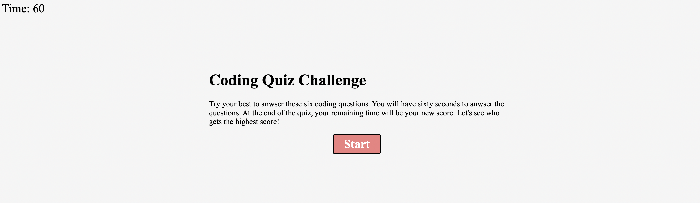
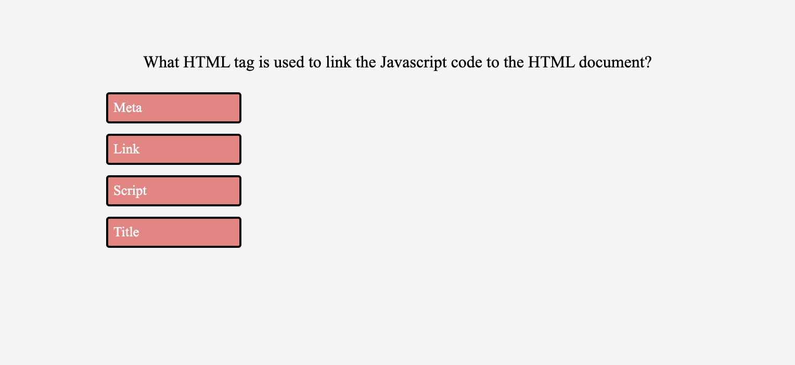
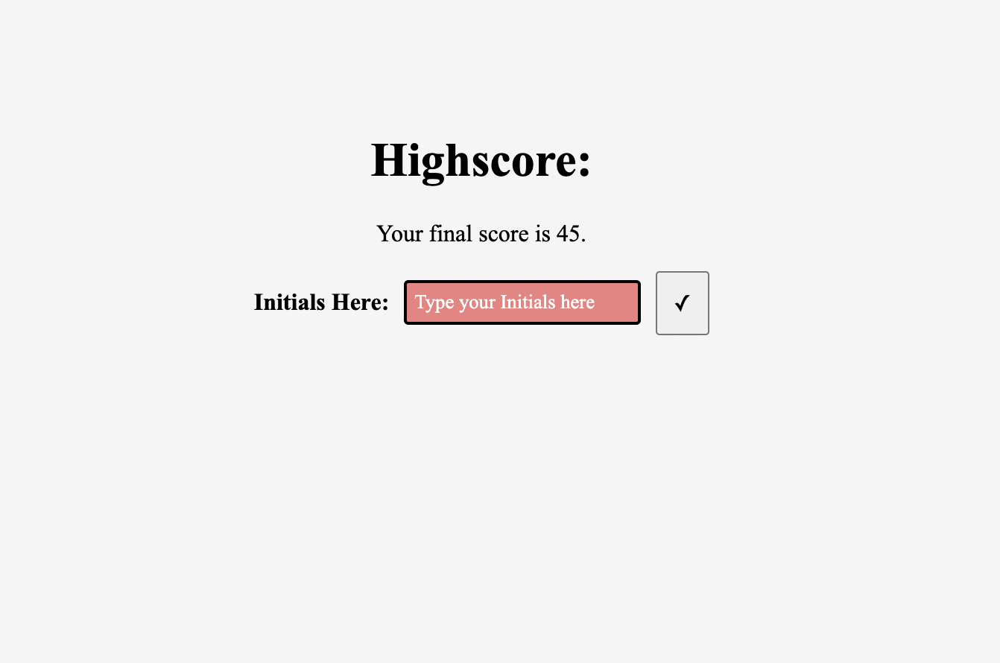

# Code Quiz Project

## Table of Contents

- Description
- Usage

[Description](#Description)

This project's goal is to create a timed code quiz to test my knowledge. To do this, I created a basic html webpage with a timer in the top right, a title, description, and start button in the center. From there I styled it with some basic colors and font styles and moved on to designing the actual Javascript.

Starting the Javascript, I created an array of objects containing all of my questions that allowed me to updating each question with a for loop. I then created a function to start the game that would hide the start game title, description, and button being replaced with the first question.

I then created a timer that would start counting down from 60. When this timer reaches 0, a function would force end the game revealing the end score page. This page would also appear if you answered all of the questions. Through an event listener, I created a way for the incorrect answers to remove 10 seconds from the timer. If you reached below 0 this way, the end score page would appear with your score at 0. 

On the end score page you can see your score and input your initials to save your score. I then locally stored your score and initials. In the top left corner, there is a link to the high scores page which displays the scores that I pulled from out of storage to fill the highscore display on screen.

[Usage](#Usage)

To use this application, you first must press the start button and this will activate the quiz. Once the quiz is underway, a timer in  the top left of the screen will start to count down and a question will appear. When you answer a question incorrectly, you will lose ten seconds on the timer, otherwise it just progresses to the next page. At the end of the quiz, an end score page will appear where you can input your initials and save your score. If you click on the view scores link in the top left, it will open a page in a new tab and display your saved score there.

Here is a link to the deployed site: https://morrisbianco.github.io/code-quiz-project/
